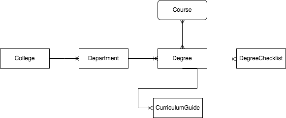
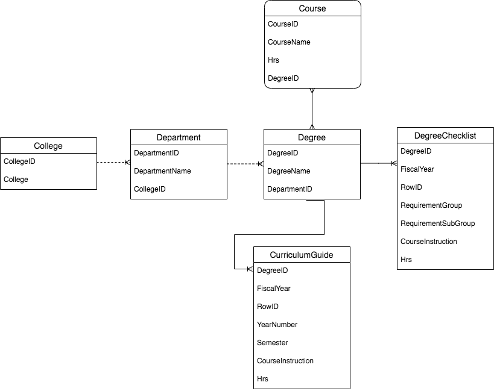
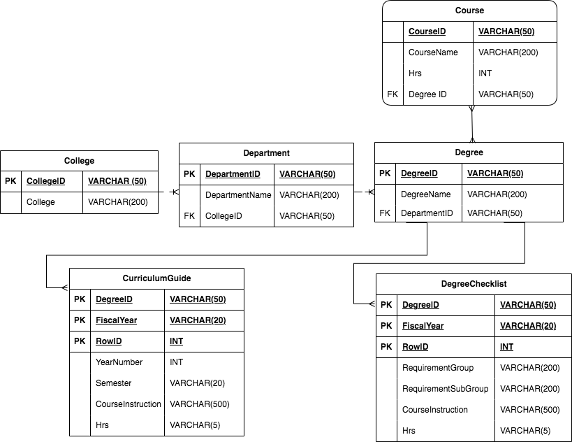

# ADVISINGSERVICES
**User Storiese**
&nbsp;
1.	As UG Student or lateral student, I want to view Degree Checklist, so we get comprehensive list of all courses required for the degree.
2.	As Student, I want to view curriculum guide, so we can use it in conjunction with the corresponding degree checklist for degree planning.
3.	As Student, I want to  view Degree Checklists in the order of Alphabetical or By College and Department, so we can easily access desired degree or by preffered college and Department.
4.	As Student, I want to view Degree Checklists for seven years, so we can choose year according to our first semester of college.
4.	As Student, Degree must be completed within six years or a new catalog will be assigned.

&nbsp;
**Natural Language**
&nbsp;
1.	Record College, their departments, and Degree they offer.
2.	Capture the Courses, credit hours and the degrees in which they are offered.
3.	Capture Degree Checklist for each fiscal year and the course requirements.
4.	Capture Curriculum Guide for each fiscal year and the course plan.
&nbsp;
**Conceptual**
&nbsp;

&nbsp;
**Logical**
&nbsp;

<&nbsp;
**Physical**
&nbsp;

