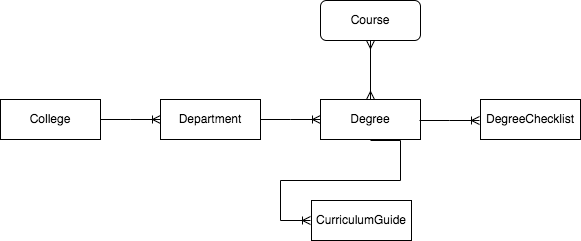
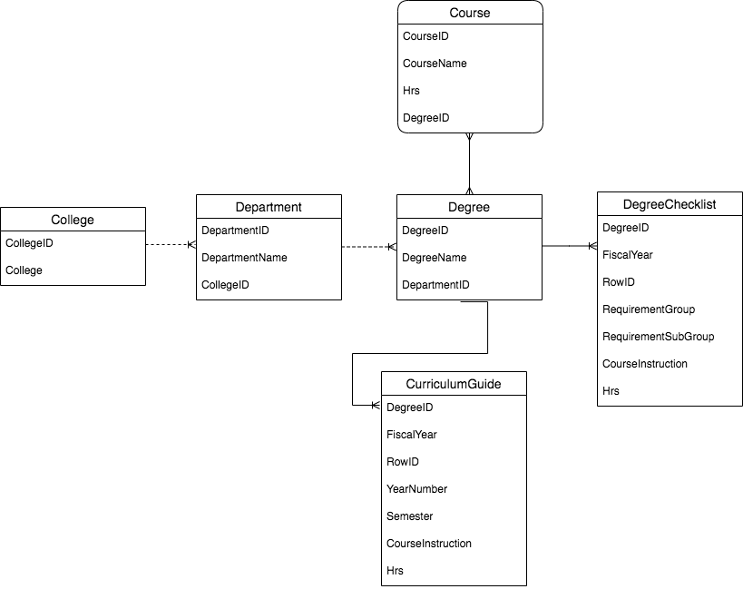
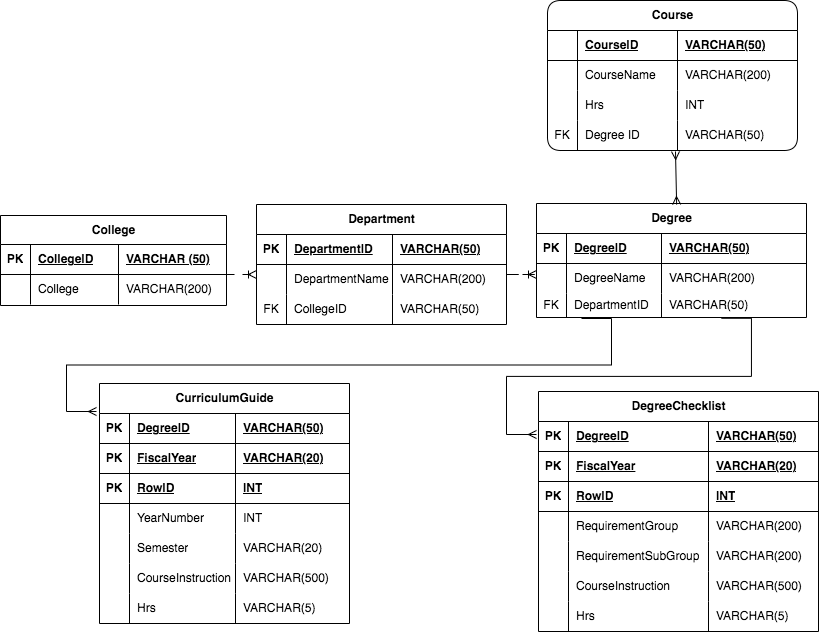

# ADVISINGSERVICES
**Natural Language**
1.	Record College, their departments, and Degree they offer.
2.	Capture the Courses, credit hours and the degrees in which they are offered.
3.	Capture Degree Checklist for each fiscal year and the course requirements.
4.	Capture Curriculum Guide for each fiscal year and the course plan.
&nbsp;

**Conceptual**

&nbsp;

**Logical**

<&nbsp;

**Physical**

